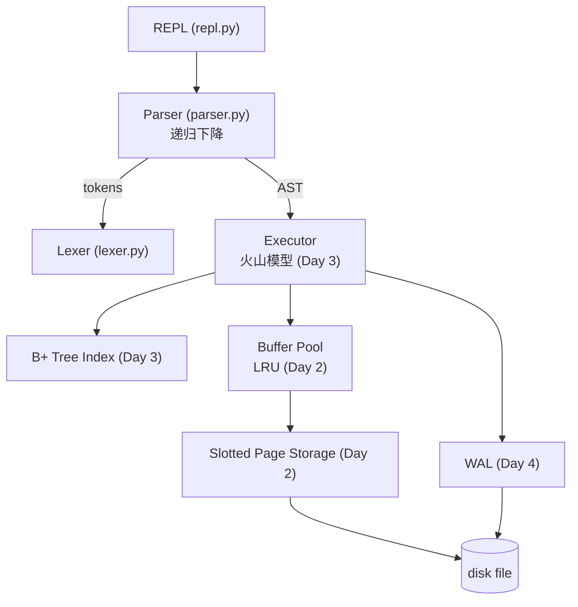

# pico-sql

**用纯 Python 从零写一个迷你关系型数据库引擎 / A tiny relational database engine in pure Python, built to learn how real databases work.**

[](https://github.com/JC-16/pico-sql/actions/workflows/ci.yml)

## 这是什么

pico-sql 是一个教学向的关系型数据库引擎：不接受任何数据库库的"魔法"，
从**词法分析 → 语法解析 → AST → 执行器 → 存储引擎 → 崩溃恢复**，
每一层都自己实现，最终得到一个能抗 `kill -9` 的 SQL 数据库。

写它的目的只有一个：**把数据库原理课变成可以运行、可以调试、可以指着代码讲的东西。**

## 当前状态与路线图

| 模块 | 状态 | 说明 |
|---|---|---|
| 词法分析器（lexer） | ✅ Day 1 | 关键字/标识符/数字/字符串/操作符，带行列号报错 |
| 递归下降语法解析器（parser） | ✅ Day 1 | SQL 子集 → AST，优先级分层 |
| 内存执行引擎 | ✅ Day 1→2 | CREATE/DROP/INSERT/SELECT/UPDATE/DELETE，语句级原子性 |
| Slotted Page 页式存储引擎 | ✅ Day 2 | 4KB 页、槽目录两端生长、墓碑标记、页内压缩 |
| LRU 缓冲池 | ✅ Day 2 | 脏页追踪、逐出回写、命中率统计、内存/磁盘双后端 |
| B+ 树索引 | ✅ Day 3 | 分裂/合并/借用全套、叶子链范围扫描、4000 次随机对拍 |
| 火山模型执行器 | ✅ Day 3 | Open/Next/Close 管线 + WHERE 主键索引下推（点查/范围） |
| WAL 预写日志 + 崩溃恢复 | ⏳ Day 4 | 真实 kill -9 崩溃演示 |
| 性能基准 | ⏳ Day 4 | 索引扫描 vs 全表扫描对比图 |

## 快速开始

```bash
git clone https://github.com/JC-16/pico-sql.git
cd pico-sql
pip install -e .[dev]
python -m picosql
```

一个真实的会话（带持久化）：

```
> python -m picosql demo.pico
pico-sql v0.1.0 -- a tiny SQL engine for learning (.help for help) [db: demo.pico]
pico-sql> CREATE TABLE users (id INT PRIMARY KEY, name VARCHAR(20), score FLOAT);
table 'users' created
pico-sql> INSERT INTO users VALUES (1, 'alice', 91.5), (2, 'bob', 72.0);
2 row(s) inserted
pico-sql> SELECT name, score FROM users WHERE score >= 60 ORDER BY score DESC;
+---------+-------+
| name    | score |
+---------+-------+
| alice   | 91.5  |
| bob     | 72.0  |
+---------+-------+
2 row(s)
pico-sql> .quit
> python -m picosql demo.pico   # 重新打开，数据还在
```

不带文件参数则运行在内存模式（`Database()` 使用 MemoryPageFile，与磁盘模式走同一条代码路径）。

## 索引加速（Day 3 起）

WHERE 里对**主键**的等值/范围条件会自动走 B+ 树（`last_scan_used_index` 可验证）：

```python
db.execute_sql("SELECT * FROM t WHERE id = 250")    # O(log n) 点查 + 单页取行
db.execute_sql("SELECT * FROM t WHERE id > 290")    # 叶子链范围扫描
db.execute_sql("SELECT * FROM t WHERE grp = 7")     # 非主键列：全表扫描（v1 只有主键索引）
```

规划规则（详见 design.md §3.13）：只下推 AND 因子中的 `主键 OP 字面量`；
OR、列间比较、非主键列全部留在 FilterOperator 的残差里逐行过滤。

跑测试：

```bash
pytest -q   # 114 tests：含 B+ 树 4000 次随机操作对拍、火山管线惰性求值证明
```

## 架构（目标形态）



图中带 Day 标注的模块按路线表逐日落地，未完成项见上方状态表的 ⏳——本仓库的 commit 历史就是实现顺序本身。

## SQL 子集

```sql
CREATE TABLE users (id INT PRIMARY KEY, name VARCHAR(20), score FLOAT, active BOOL);
DROP TABLE users;
INSERT INTO users VALUES (1, 'alice', 91.5, true), (2, 'bob', 72.0, false);
INSERT INTO users (id, name) VALUES (3, 'carol');
SELECT name, score FROM users WHERE score >= 60 AND active = true ORDER BY score DESC LIMIT 10;
UPDATE users SET score = score + 5 WHERE id = 2;
DELETE FROM users WHERE id = 3;
```

表达式支持 `+ - * / %`、比较、`AND / OR / NOT`、括号、`NULL / TRUE / FALSE`，
并遵循 SQL 三值逻辑（`NULL` 参与比较结果是 `NULL`，`WHERE` 视为不匹配）。

## Known Limitations（诚实清单）

- **崩溃语义（pre-WAL）**：脏页在 `close()` 或逐出时落盘；进程在之前崩溃会丢数据——这正是 Day 4 WAL 要解决的问题。（语句级原子性已保证：INSERT/UPDATE 先全量校验后统一写入，失败语句零残留）
- **PRIMARY KEY 允许 NULL**（与标准 SQL 的"主键隐含 NOT NULL"不同），且多个 NULL 主键互不冲突（各自不入索引）；有测试固化此偏差
- **无文件锁**：两个进程同时打开同一数据库文件会互相覆盖（真实引擎有实例锁/锁页）
- 页 0 的目录（catalog）用 JSON 存储（真实数据库用专用二进制页 + 事务性更新）；单页 4KB 限制 schema 总量
- 主键索引用 dict 实现（Day 3 换 B+ 树）；索引不持久化，启动时重建
- 已删除的记录在页内留下墓碑，字节在页被复用前仍留在文件里（与真实数据库相同的隐私权衡）
- 字符串比较/排序是 Unicode 码点序（真实数据库有 collation 排序规则）
- 数字字面量不支持科学计数法（`1e5`）；整数值域为 INT64（越界报错而非截断）
- 不支持多表 JOIN、聚合函数（COUNT/SUM...）、事务隔离级别
- 不支持并发客户端连接
- 整数除法向零截断（SQL 风格），负数取模沿用 Python 语义——两处都有文档说明

每一项限制在真实数据库里如何解决，见 `docs/design.md` 与 `INTERVIEW_QA.md`。

## 文档导航

- [docs/design.md](docs/design.md) —— 架构设计、文法定义、演进日志
- [STUDY.md](STUDY.md) —— 逐模块学习指南（含动手练习）
- [INTERVIEW_QA.md](INTERVIEW_QA.md) —— 面试问答预演（含追问链）

## License

MIT — 见 [LICENSE](LICENSE)。
