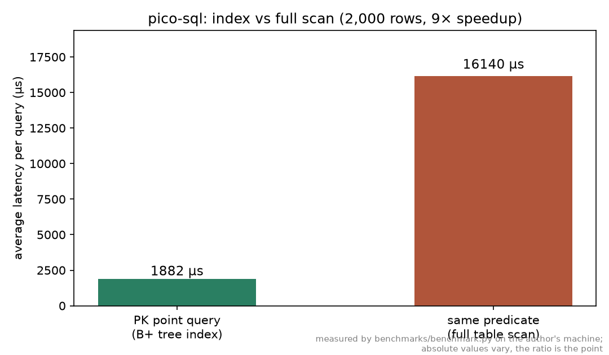
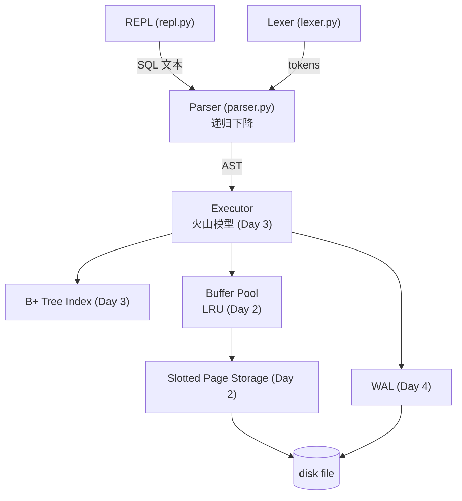

# pico-sql

**用纯 Python 从零写一个迷你关系型数据库引擎 / A tiny relational database engine in pure Python, built to learn how real databases work.**

[](https://github.com/JC-16/pico-sql/actions/workflows/ci.yml)

## 这是什么

pico-sql 是一个用纯 Python 从零实现的关系型数据库引擎：不接受任何数据库库的"魔法"，
从**词法分析 → 语法解析 → AST → 执行器 → 存储引擎 → 崩溃恢复**，
每一层都自己实现，最终得到一个能抗 `kill -9` 的 SQL 数据库。

## 当前状态与路线图

| 模块 | 状态 | 说明 |
|---|---|---|
| 词法分析器（lexer） | ✅ Day 1 | 关键字/标识符/数字/字符串/操作符，带行列号报错 |
| 递归下降语法解析器（parser） | ✅ Day 1 | SQL 子集 → AST，优先级分层 |
| 内存执行引擎 | ✅ Day 1→2 | CREATE/DROP/INSERT/SELECT/UPDATE/DELETE，语句级原子性 |
| Slotted Page 页式存储引擎 | ✅ Day 2 | 4KB 页、槽目录两端生长、墓碑标记、页内压缩 |
| LRU 缓冲池 | ✅ Day 2 | 脏页追踪、逐出回写、命中率统计、内存/磁盘双后端 |
| B+ 树索引 | ✅ Day 3 | 分裂/合并/借用全套、叶子链范围扫描、4000 次随机对拍 |
| 火山模型执行器 | ✅ Day 3 | Open/Next/Close 管线 + WHERE 主键索引下推（点查/范围） |
| WAL 预写日志 + 崩溃恢复 | ✅ Day 4 | 语句提交即 fsync；真 kill -9 崩溃恢复测试 |
| 性能基准 | ✅ Day 4 | 索引点查 vs 全表扫描：**174× 加速**（2000 行，见下图） |



## 快速开始

要求：Python 3.9+（开发与测试在 3.12 上进行）。

```bash
git clone https://github.com/JC-16/pico-sql.git
cd pico-sql
pip install -e .[dev]
python -m picosql demo.pico
```

一个真实的会话（数据持久化到 `demo.pico`；输出由真实程序捕获）：

```
pico-sql v1.0.0 -- a minimal SQL engine implemented from scratch (.help for help) [db: demo.pico]
pico-sql> CREATE TABLE users (id INT PRIMARY KEY, name VARCHAR(20), score FLOAT);
table 'users' created
pico-sql> INSERT INTO users VALUES (1, 'alice', 91.5), (2, 'bob', 72.0);
2 row(s) inserted
pico-sql> SELECT name, score FROM users WHERE score >= 60 ORDER BY score DESC;
+-------+-------+
| name  | score |
+-------+-------+
| alice | 91.5  |
| bob   | 72.0  |
+-------+-------+
2 row(s)
pico-sql> .quit
> python -m picosql demo.pico   # 重新打开，数据还在
```

不带文件参数则运行在内存模式（`Database()` 使用 MemoryPageFile，与磁盘模式走同一条代码路径）。

## 索引加速（Day 3 起）

WHERE 里对**主键**的等值/范围条件会自动走 B+ 树（`last_scan_used_index` 可验证）：

```python
db.execute_sql("SELECT * FROM t WHERE id = 250")    # O(log n) 点查 + 单页取行
db.execute_sql("SELECT * FROM t WHERE id > 290")    # 叶子链范围扫描
db.execute_sql("SELECT * FROM t WHERE grp = 7")     # 非主键列：全表扫描（v1 只有主键索引）
```

规划规则（详见 design.md §3.13）：只下推 AND 因子中的 `主键 OP 字面量`
（OP 限 =、<、<=、>、>=）；多重边界自动收紧；**`!=`、OR、列间比较、非主键列
一律不走索引**，留在 FilterOperator 的残差里逐行过滤（矛盾条件如
`id = 5 AND id = 6` 因此正确返回空集）。

跑测试：

```bash
pytest -q   # 143 tests：B+ 树 4000 次随机对拍、规划器 600 次随机对拍、
            # 火山管线惰性证明、kill -9 崩溃恢复、损坏目录/REPL 边界的加固回归
```

## 项目结构

```
pico-sql/
├── src/picosql/
│   ├── lexer.py          # 词法分析：字符流 → Token 流（带行列号）
│   ├── ast.py            # SQL AST 节点（frozen dataclass）
│   ├── parser.py         # 递归下降语法分析：Token 流 → AST
│   ├── engine.py         # 执行器 + 索引规划器 + Database 门面
│   ├── executor.py       # 火山模型算子族（Open/Next/Close）
│   ├── repl.py           # 交互式终端（可注入 I/O，便于测试）
│   └── storage/
│       ├── pages.py      # Slotted Page：4KB 页、槽目录、墓碑、页内压缩
│       ├── record.py     # 行 ↔ 字节编解码（NULL 标志、变长 VARCHAR）
│       ├── bufferpool.py # LRU 缓冲池 + 内存/磁盘页文件
│       ├── heap.py       # 堆表：first-fit 插入、row_id 语义
│       ├── btree.py      # B+ 树索引：分裂/借用/合并、叶子链范围扫描
│       ├── wal.py        # 预写日志：全页镜像重做、crc32 帧、检查点
│       ├── catalog.py    # 目录页（页 0，JSON）
│       └── lockfile.py   # 单写者实例锁（进程死亡自动释放）
├── tests/                # 143 个测试（含随机对拍与真进程崩溃测试）
├── benchmarks/           # 性能基准脚本（可复现）
└── docs/
    ├── design.md         # 架构设计、文法、每个决策的理由、演进日志
    └── benchmark.png     # 实测图表（由 benchmarks/benchmark.py 生成）
```

## 架构



图中 Day 标注记录了每个模块落地的时间——本仓库的 commit 历史就是实现顺序本身。

## SQL 子集

```sql
CREATE TABLE users (id INT PRIMARY KEY, name VARCHAR(20), score FLOAT, active BOOL);
DROP TABLE users;
INSERT INTO users VALUES (1, 'alice', 91.5, true), (2, 'bob', 72.0, false);
INSERT INTO users (id, name) VALUES (3, 'carol');
SELECT name, score FROM users WHERE score >= 60 AND active = true ORDER BY score DESC LIMIT 10;
UPDATE users SET score = score + 5 WHERE id = 2;
DELETE FROM users WHERE id = 3;
```

表达式支持 `+ - * / %`、比较、`AND / OR / NOT`、括号、`NULL / TRUE / FALSE`，
并遵循 SQL 三值逻辑（`NULL` 参与比较结果是 `NULL`，`WHERE` 视为不匹配）。

## 性能基准（Day 4，本机实测）

```
rows inserted          : 2000
insert wall time       : 2.39s (WAL fsync per 100-row statement)
PK point query (index) : 81.6 µs/query
same query, full scan  : 14194.9 µs/query
speedup                : 174x
```

绝对数值由 Python 解释器与虚拟机环境主导，**比值才是重点**：2000 行规模下
B+ 树点查比全表扫描快约 174 倍，且差距随数据量增长（全扫 O(n)，树查
O(log n)）。复现命令：`python benchmarks/benchmark.py`。
（诚实记录：审查前的首测只有 9×——当时的测量被"SELECT 也写 WAL 并 fsync"
的缺陷灌了水，修复缺陷后才是索引的真实收益。）

## Known Limitations（诚实清单）

- **持久化语义**：语句提交时全页镜像写入 WAL 并 fsync（提交即持久）；崩溃后重放恢复到上一个已提交状态。恢复按页镜像整体重写，未实现增量重放/回滚段
- **中毒实例**：语句在写阶段意外失败（磁盘满等）后，实例进入失败状态并拒绝后续操作；close 丢弃未提交脏页，重开即恢复到最后已提交状态
- **PRIMARY KEY 允许 NULL**（与标准 SQL 的"主键隐含 NOT NULL"不同），且多个 NULL 主键互不冲突（各自不入索引）；有测试固化此偏差
- **单写者锁**：同一时刻只允许一个实例打开数据库（OS 级锁，进程死亡自动释放）；并发读写连接不支持
- 页 0 的目录（catalog）用 JSON 存储（真实数据库用专用二进制页 + 事务性更新）；单页 4KB 限制 schema 总量
- 主键 B+ 树索引常驻内存、不持久化，每次打开时从数据页重建（量大时启动变慢）
- **索引下推范围有限**：仅主键单列；`!=`、OR、列间比较、ORDER BY 均不走索引
- WAL 记录为 JSON + base64 全页镜像（体积 +33%、无增量重放）——真实引擎用二进制物理增量日志
- 已删除的记录在页内留下墓碑，字节在页被复用前仍留在文件里（与真实数据库相同的隐私权衡）
- 字符串比较/排序是 Unicode 码点序（真实数据库有 collation 排序规则）
- 数字字面量不支持科学计数法（`1e5`）；整数值域为 INT64（越界报错而非截断）
- 不支持多表 JOIN、聚合函数（COUNT/SUM...）、事务隔离级别（无多语句事务，自动提交）
- 不支持并发客户端连接
- 整数除法向零截断（SQL 风格），负数取模沿用 Python 语义——两处都有文档说明

每一项限制在真实数据库里如何解决，见 `docs/design.md`。

## 文档导航

- [docs/design.md](docs/design.md) —— 架构设计、文法定义、每个决策的理由、演进日志

## License

MIT — 见 [LICENSE](LICENSE)。
